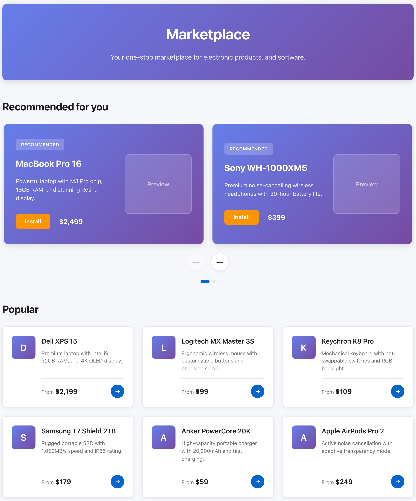

# React Marketplace

A modern, responsive marketplace platform built with React for learning and demonstrating core React concepts. This project showcases a product catalog with multiple categories, detailed product pages, and an intuitive user interface.

## 🎯 Project Goal

This project is designed as a **learning resource for React beginners**. It demonstrates fundamental React concepts through a practical, real-world application. All components are thoroughly documented with inline comments to help understand React patterns and best practices.

## ✨ Features

- Browse products across multiple categories (Electronics, Software, Accessories)
- View detailed product information with features and specifications
- Responsive design that works on all devices
- Fast, smooth navigation with React Router
- Context API for state management
- Clean, modern UI with organized component structure

## 🛠️ Tech Stack

- **React** - JavaScript library for building user interfaces
- **React Router** - Declarative routing for React applications
- **Create React App** - Build toolchain for React projects
- **JSON Data** - Mock data instead of database for simplified setup

## 🚀 Getting Started

### Prerequisites

- Node.js (v14 or higher)
- npm (comes with Node.js) or yarn

### Installation

1. **Clone the repository**
   ```bash
   git clone https://github.com/yourusername/react-marketplace.git
   cd react-marketplace
   ```

2. **Install dependencies**
   ```bash
   npm install
   ```

3. **Start the development server**
   ```bash
   npm start
   ```

4. **Open your browser**
   
   Navigate to [http://localhost:3000](http://localhost:3000) to view the application.

The page will automatically reload when you make changes. You may also see lint errors in the console.

## 📸 Screenshots

### Marketplace Screenshot



## 📁 Project Structure

```
react-marketplace/
├── src/
│   ├── components/          # Reusable React components
│   │   ├── ProductCard.jsx  # Individual product display
│   │   ├── ProductSection.jsx  # Product category sections
│   │   └── ProductDetail.jsx   # Detailed product page
│   ├── contexts/            # Context API for state management
│   │   └── ProductContext.jsx
│   ├── data/               # Mock JSON data
│   │   └── products.json
│   ├── App.js              # Main application component
│   └── index.js            # Application entry point
├── public/                 # Static assets
└── package.json           # Project dependencies
```

## 💡 Key Features for Learning

- **Well-Documented Code**: Every component includes detailed comments explaining React concepts and implementation patterns
- **JSON-Based Data**: Uses `products.json` instead of a database to simplify setup and focus on React fundamentals
- **Component Organization**: Clear separation of concerns with dedicated folders for components, contexts, and data
- **Best Practices**: Follows React coding standards and conventions suitable for beginners

## 📚 React Concepts Demonstrated

### **Components & Props**
Reusable UI building blocks (`ProductCard`, `ProductSection`) that accept and display data through props, demonstrating component composition and data flow.

### **React Router**
Client-side routing enabling navigation between home page and product detail pages without full page reloads, creating a smooth single-page application experience.

### **Context API**
Global state management using `ProductContext` to share product data across components without prop drilling, demonstrating efficient data access patterns.

### **Hooks (useState, useEffect, useContext, useParams)**
Modern React patterns for managing component state, side effects, accessing context data, and reading URL parameters for dynamic routing.

### **JSX & Conditional Rendering**
Writing HTML-like syntax in JavaScript and dynamically showing/hiding UI elements based on data availability and application state.

### **CSS Modules & Component Styling**
Each component has its dedicated CSS file following BEM naming convention, demonstrating modular and maintainable styling approaches.

## 🧪 Available Scripts

### `npm test`
Launches the test runner in interactive watch mode.

### `npm run build`
Builds the app for production to the `build` folder. The build is optimized and minified for deployment.

### `npm run eject`
**Note: This is a one-way operation!** Ejects from Create React App to access configuration files.

## 📝 License

This project is open source and available under the MIT License.

## 🔗 Learn More

- [Create React App Documentation](https://facebook.github.io/create-react-app/docs/getting-started)
- [React Documentation](https://reactjs.org/)
- [React Router Documentation](https://reactrouter.com/)

---

**Perfect for**: React beginners, portfolio projects, learning modern web development patterns
